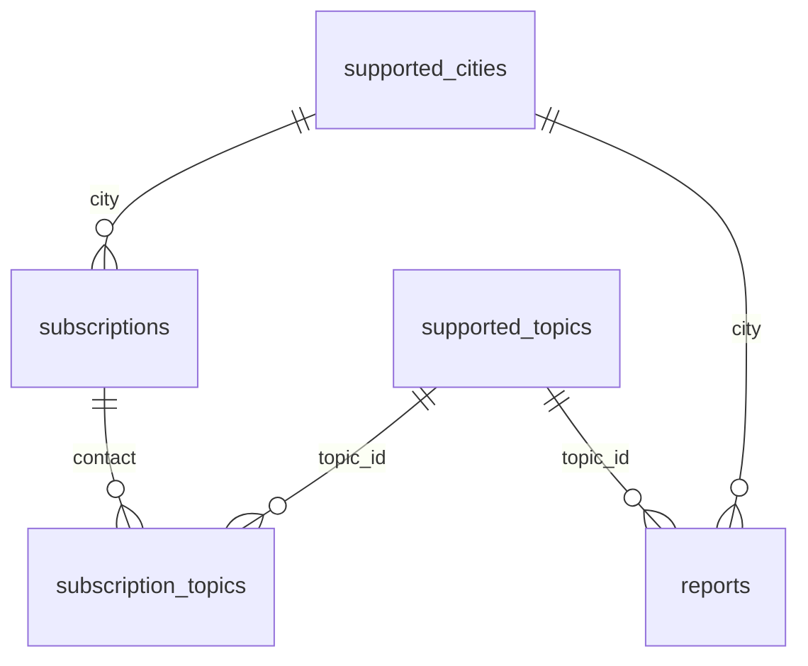

# Database Infrastructure

This refactor enforces consistency for supported cities and topics by centralizing lookup tables and using formal foreign-key constraints to link them to subscriptions. A junction table implements the many-to-many relationship between subscriptions and topics, ensuring the SQL engine formally recognizes all relational dependencies.

## subscriptions

| Column | Type | Notes |
| --- | --- | --- |
| `contact` | `text` | Primary key; subscriber email or handle. |
| `city` | `text` | Foreign key → `supported_cities.city`. |

Each subscription holds a unique contact identifier and references exactly one city. Topics are managed through the `subscription_topics` junction table.

## supported_cities

| Column | Type | Notes |
| --- | --- | --- |
| `city` | `text` | Primary key; canonical city label referenced by `subscriptions.city`. |

This lookup table constrains subscriptions to the vetted list of launch markets while keeping the city strings human-readable.

## supported_topics

| Column | Type | Notes |
| --- | --- | --- |
| `topic_id` | `integer` | Identity primary key; referenced by `subscription_topics.topic_id`. |
| `topic_name` | `text` | Unique canonical label (e.g., `immigration`, `civil rights`, `economy`). |
| `description` | `text` | Short explanation of what the topic covers. |

The initial seed rows capture the three core topics (immigration, civil rights, economy). New topics must be inserted here first so the junction table can reference their IDs.

## subscription_topics (Junction Table)

| Column | Type | Notes |
| --- | --- | --- |
| `subscription_id` | `text` | Foreign key → `subscriptions.contact` (ON DELETE CASCADE). |
| `topic_id` | `integer` | Foreign key → `supported_topics.topic_id` (ON DELETE CASCADE). |

This junction table implements the **many-to-many relationship** between subscriptions and topics. Each row links one subscription to one topic; a subscription can have multiple topic rows, and a topic can be referenced by multiple subscriptions. Both foreign keys enforce referential integrity and cascade deletes to keep the junction table clean.

## reports

| Column | Type | Notes |
| --- | --- | --- |
| `report_id` | `bigint` | Identity primary key. |
| `city` | `text` | Foreign key → `supported_cities.city`. |
| `topic_id` | `integer` | Foreign key → `supported_topics.topic_id`. |
| `report_date` | `date` | Date the report covers; defaults to `CURRENT_DATE`. |
| `items` | `jsonb` | Array of legislation items, each `{"header": "...", "description": "..."}`. |
| `sources` | `text[]` | Array of source URLs cited in the report. |
| `created_at` | `timestamptz` | Timestamp of row creation; defaults to `now()`. |

Each row stores one pipeline run's output for a city+topic+date. A unique constraint on `(city, topic_id, report_date)` enforces one report per combination per day; re-runs upsert over the existing row.

## Entity Relationships

The diagram shows:
- `supported_cities` supplies city references that `subscriptions` and `reports` must conform to (one-to-many).
- `supported_topics` is referenced by both `subscription_topics` (subscriber preferences) and `reports` (pipeline output).
- `subscriptions` and `supported_topics` are linked through the `subscription_topics` junction table, forming a many-to-many relationship.
- Formal foreign-key constraints are enforced on all edges, preventing orphaned references and maintaining data integrity across the entire schema.

## Operational Guidance

- **Seed lookup tables first**: ensure all topics and cities exist in their respective lookup tables before creating subscriptions or junction table entries.
- **Insert topics before linking**: when adding a new topic, insert it into `supported_topics`, then create rows in `subscription_topics` to link it to existing subscriptions.
- **Leverage cascade deletes**: if a subscription or topic is deleted, the corresponding junction table rows are automatically removed, keeping the schema clean.
- **Query patterns**: to fetch all topics for a subscription, join `subscriptions` → `subscription_topics` → `supported_topics`. To find all subscribers of a topic, reverse the join direction.
- **Maintain referential integrity**: never insert into `subscription_topics` without first ensuring both the subscription and topic exist in their parent tables; the database will reject violations.

## Code Integration

All tables are queried via `utils/supabase_client.py`:

- `get_supported_topics()` → `list[str]` of topic names from `supported_topics`
- `get_all_subscribers_with_cities_and_topics()` → `list[dict]` with `contact`, `city`, and `topics` keys (uses PostgREST nested join through `subscription_topics`)
- `get_subscribers_for_topic(topic)` → `list[str]` of emails via `subscription_topics` inner join

Reports are saved via `utils/report/storage.py`:

- `save_report(city, topic_name, items, sources)` → upserts a single report row
- `save_all(results)` → saves all pipeline results to the `reports` table

The email dispatcher (`pipelines/node/email_dispatcher.py`) uses subscriber topic preferences to build per-subscriber filtered emails.
