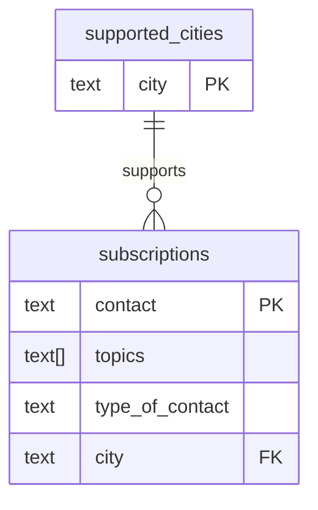

# Subscriptions ↔ Supported Cities Mapping

This document explains how to normalize the `subscriptions` table by turning the `city` column into a foreign key that targets the primary key on a new `supported_cities` lookup table.

## Table Definitions

### subscriptions

| Column           | Type        | Notes                                  |
| ---------------- | ----------- | -------------------------------------- |
| `contact`        | `text`      | Primary key; unique identifier         |
| `topics`         | `text[]`    | List of subscribed topics              |
| `type_of_contact`| `text`      | Channel classification (email, SMS, …) |
| `city`           | `text`      | Foreign key → `supported_cities.city`  |

### supported_cities

| Column | Type   | Notes                            |
| ------ | ------ | -------------------------------- |
| `city` | `text` | Primary key; canonical city name |

## Mermaid Diagram



## Relationship Overview

- The `supported_cities.city` column is the surrogate lookup table for every city value that a subscription can reference.
- Each row in `subscriptions` must reference an existing `supported_cities.city` value; deletion of a supported city should be blocked (or cascade) depending on business rules.
- The lookup table stores exactly one row per canonical city string; use consistent casing and spacing because that value becomes the foreign key target.

## Suggested SQL DDL

```sql
CREATE TABLE IF NOT EXISTS supported_cities (
    city text PRIMARY KEY
);

ALTER TABLE subscriptions
    ADD CONSTRAINT subscriptions_city_fkey
    FOREIGN KEY (city) REFERENCES supported_cities(city)
    ON UPDATE CASCADE
    ON DELETE RESTRICT; -- adjust if cascading deletes are desired
```

## Migration Checklist

1. **Backfill lookup table** – insert the distinct set of existing `subscriptions.city` values into `supported_cities(city)`.
2. **Enforce canonical names** – decide on casing/formatting rules and normalize values before adding the foreign key.
3. **Add constraint** – run the `ALTER TABLE` statement once every subscription row references a valid supported city.
4. **Update writers** – ensure any process that creates or updates subscriptions also validates against (or inserts into) `supported_cities` so the constraint is never violated.

Following this mapping ensures referential integrity between subscriber records and the list of cities your pipeline supports.
